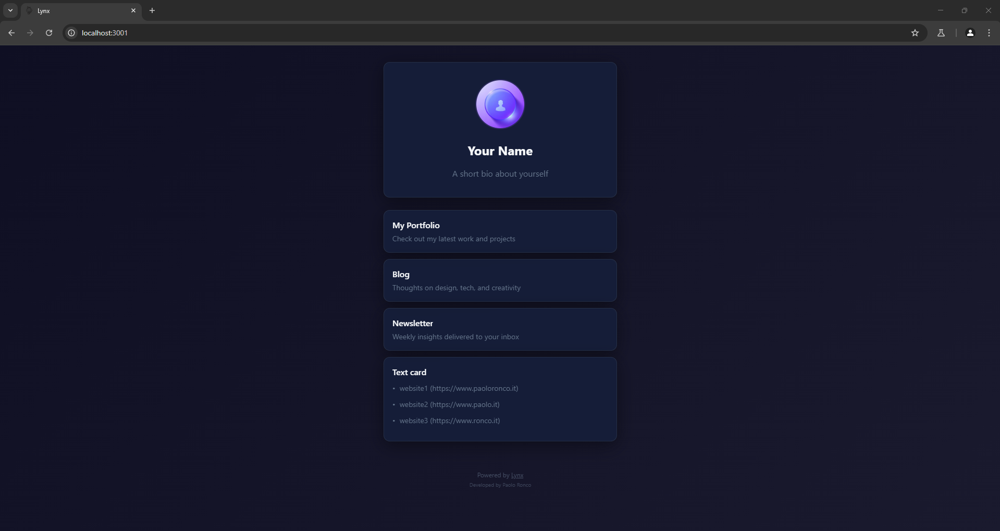
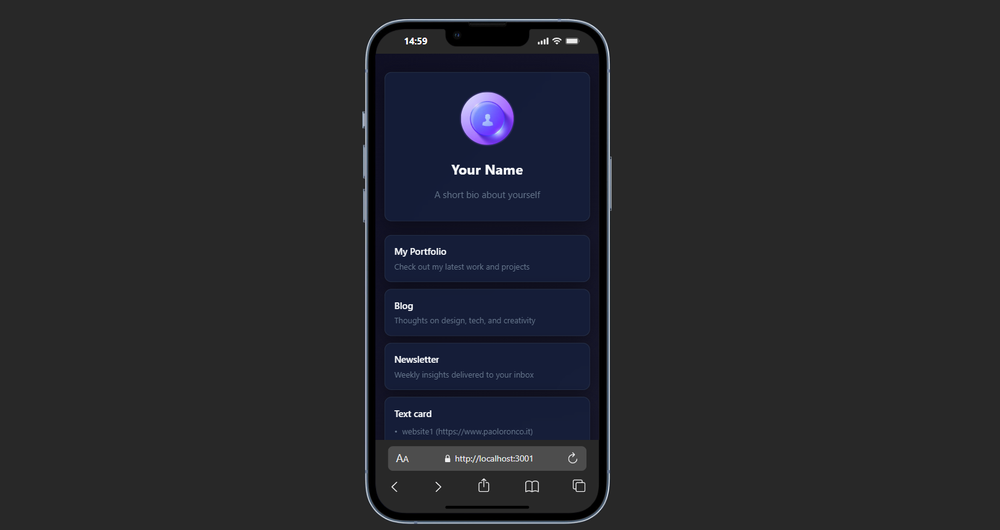
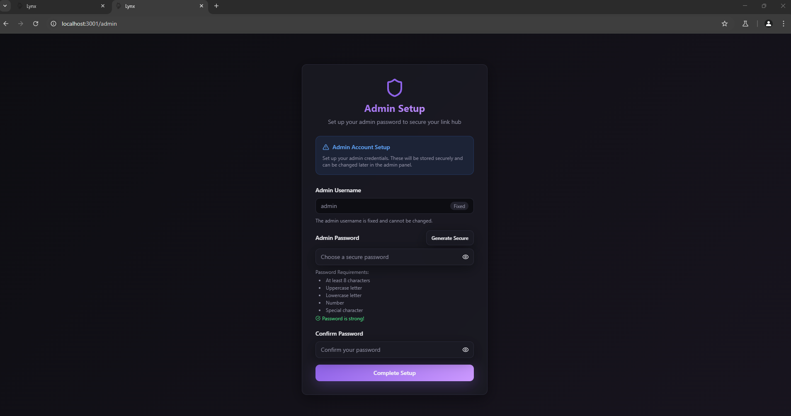
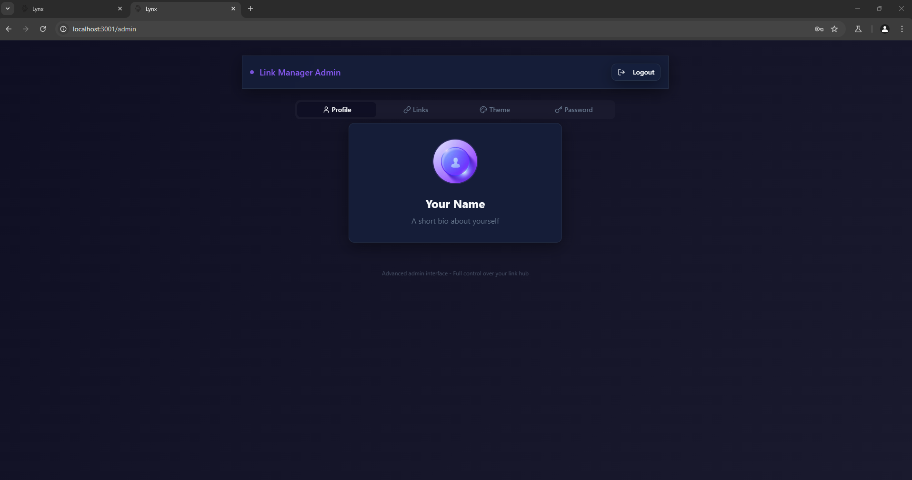
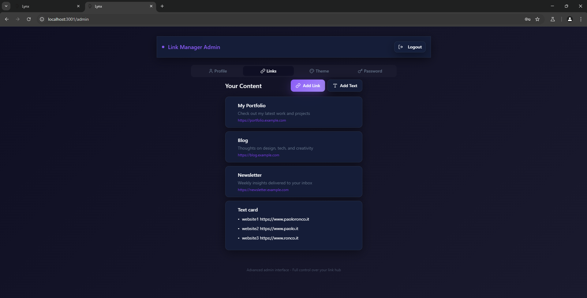
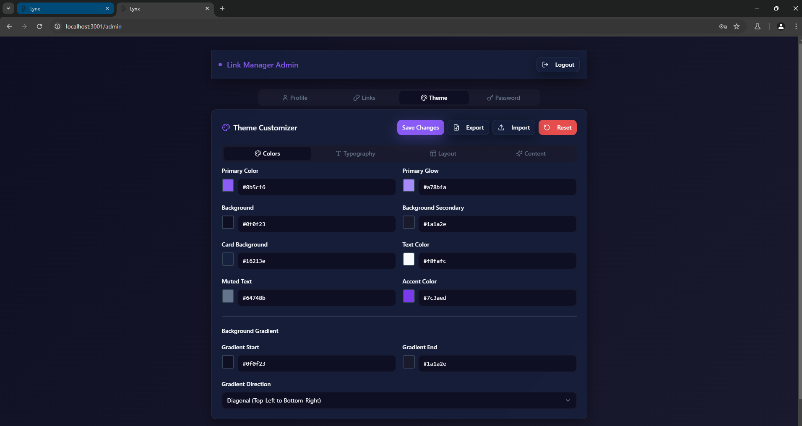
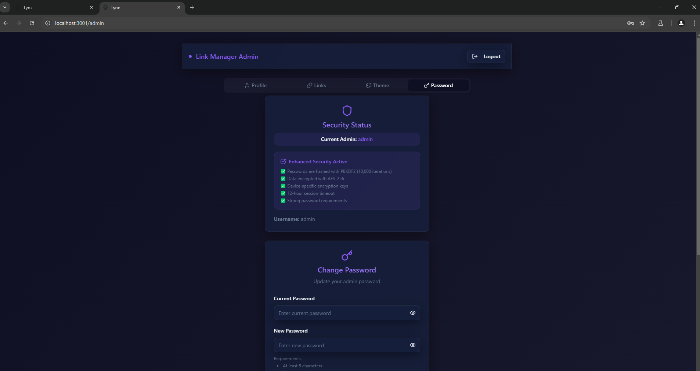

# Lynx

### Your personal links hub

[](https://github.com/paoloronco/Lynx)

**Lynx** is an open-source, self-hosted link manager that helps you gather all your digital touchpoints in a single page, with secure authentication and a fully customizable design.

* * *

## ✨ Features

* 🗂 **Standalone** → no Firebase, Supabase, or external DBs
* 🗄 **SQLite Database** → self-contained, file-based storage
* 🔐 **Secure Authentication** → bcryptjs password hashing + JWT tokens
* 🛠 **Admin Panel** → manage links, themes, profile, and settings
* 🎨 **Full Customization** → themes, colors, fonts, and layouts
* 🚀 **Deploy Anywhere** → Vercel, Docker, Linux server, Heroku

* * *

### 🔒 Security Features

* Password Hashing: bcryptjs (12 salt rounds)
* JWT Authentication: signed tokens (7-day expiry)
* Database Safety: parameterized queries against SQLite
* Session Security: cookies set HttpOnly and SameSite

* * *

## 🛠 Tech Stack

  
  
  
  
  
  

* * *

## 📸 Screenshots

  
*Public page displaying profile and all links.*

  
*Public page mobile view.*

  
*Initial setup screen to create the admin password.*

  
*Admin profile section to edit name and bio.*

  
*Admin links manager to add, edit, and organize links or text cards.*

  
*Theme customizer for colors, layout, and styles.*

  
*Password & security panel with change password and reset options.*

* * *

## 🎥 Video

#### How to deploy Lynx
[](https://www.youtube.com/watch?v=x1MVY4vreOk)

* * *

## 🚀 Quick Start

### 1. Clone, Install & Run

*(prerequisite: Node.js 18+)*
    git clone https://github.com/paoloronco/Lynx.git
    cd Lynx
    npm ci
    cd server
    npm ci
    cd ..
    npm start

<p> Public → http://localhost:5173
<p> Admin → http://localhost:5173/admin

<<<<<<< HEAD
### 2. 🚀 Deploy on Render

You can deploy **Lynx** on [Render](https://render.com) in a few steps:

0. Fork this repo
1. Go to **Render Dashboard → New → Web Service**
2. Connect **GitHub repo (Lynx)**
3. Set the following commands:
   - **Build Command**
     ```bash
     bun install && bun run build && cd server && bun install
     ```
   - **Start Command**
     ```bash
     bun run start
     ```
4. Click **Create Web Service** and wait for the deployment ✨

Your app will be available at a URL like:  
=======
### 2. 🚀Deploy on Render

You can deploy **Lynx** on [Render](https://render.com) in a few steps:

1. Fork this repo

2. Go to **Render Dashboard → New → Web Service**

3. Connect your **GitHub repo (Lynx)**

4. Set the following commands:
   
   - **Build Command**
     
     ```bash
     bun install && bun run build && cd server && bun install
     ```
   
   - **Start Command**
     
     ```bash
     bun run start
     ```

5. Click **Create Web Service** and wait for the deployment ✨

Your app will be available at a URL like:  

* * *

## 📝 Changelog

v2.1.0

Admin → Links
✅ Fixed background color, text color, emoji/icon, and size options (now working correctly)
✅ Fixed the Text Card:
   • can now be deleted
   • “Additional text content” is saved and displayed correctly
   • styling issues aligned with normal cards

Admin → Theme
✅ Improved the theme system:
   • themes can be customized reliably (previous bugs resolved)
   • changes now apply to both public page and admin interface

Admin → Profile
✅ If the bio is empty, it is automatically hidden and the profile card layout adjusts with no blank space

* * *

## 📌 To-Do / Next Steps

Admin → Theme
  * Card Spacing option not working yet → needs fixing

Admin → Reset
  * Rename button “Reset Authentication” to simply “Reset”

Make the reset button fully reset the application:
  * clear account
  * clear links
  * clear profile
  * clear themes
  * bring the app back to the initial installation state
>>>>>>> 54f20e1 (Release v2.1.0)

* * *

👨‍💻 Developed With

* ChatGPT

* Claude

* Lovable

* * *

📜 License

This project is licensed under the MIT License.
Free to use, share, and modify.
<<<<<<< HEAD
=======

>>>>>>> 54f20e1 (Release v2.1.0)
